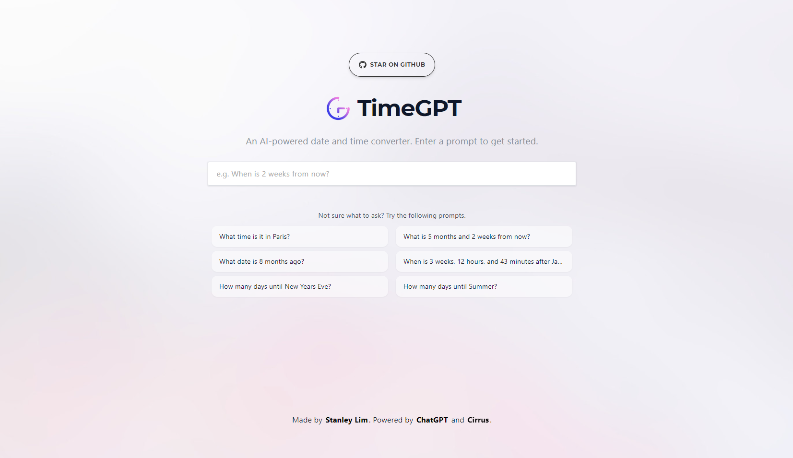
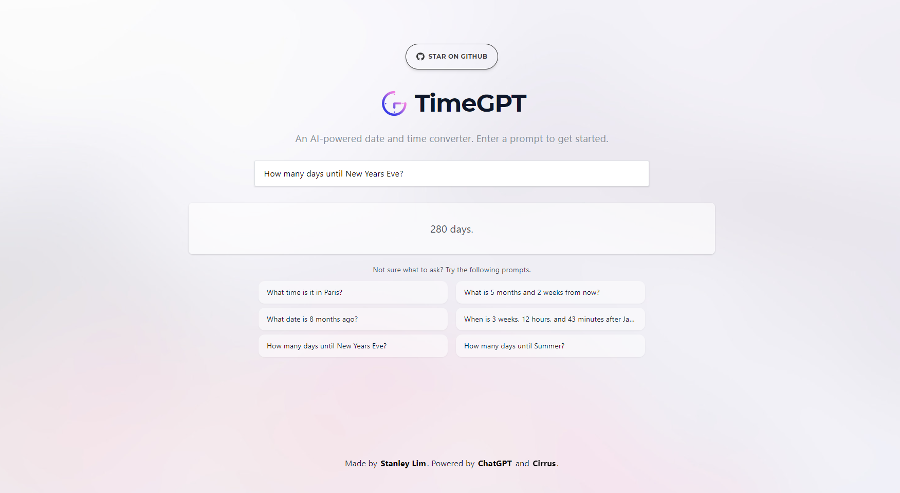

# TimeGPT

## ✨ Features

- Enter a query simply by writing a sentence.
- Find the duration of time between two periods of time.
- Find times for people in different timezones.

>NOTE: Accuracy of results rely on the amount of training OpenAI has done with chatgpt-3.5-turbo. You may see some inaccurate responses as a result.

## 🏗️ Built With

- ⚡ [Next.js](https://nextjs.org/)
- ☁ [Cirrus](https://www.cirrus-ui.com/)
- 🤖 [ChatGPT](https://chat.openai.com/chat)

## 📷 Images

